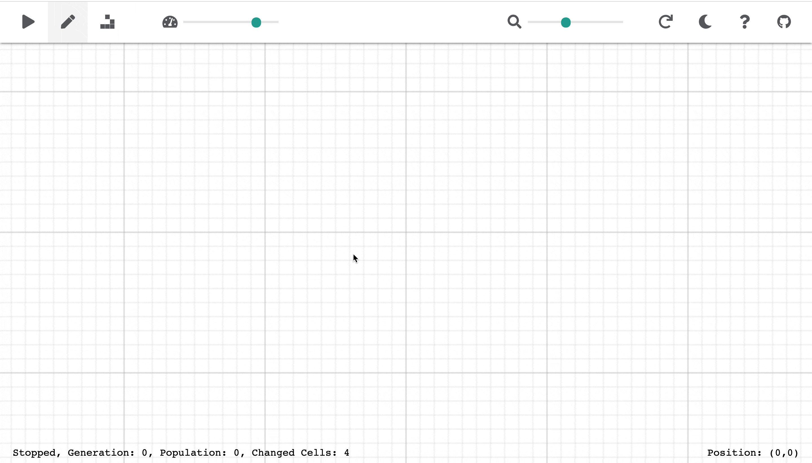
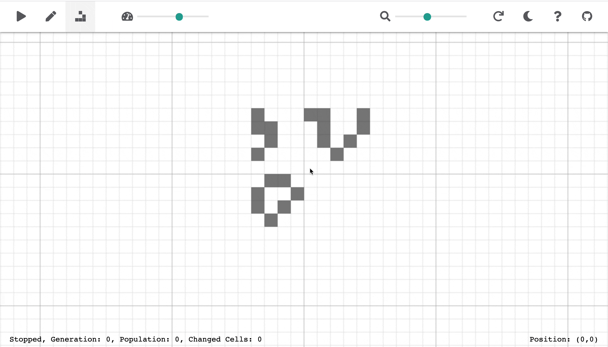

# Conway's Game of Life

This is an implementation of Conway's Game of Life written in Javascript and Rust. The game universe is 5000 cells by 5000 cells, with the edges wrapping around.

To improve performance, the game results are calculated by a WebAssembly module written in Rust and run in the background using a Web Worker.

HTML 5 Canvas is used for the game UI. The canvas is updated as data is received from the worker. Only modified areas are redrawn when possible.

The game features pan and zoom controls which updates the position and scale of the game canvas.

RxJS is used to manage mouse and keyboard events by the user.

A live version is available at http://life.aperance.dev.

## How to Play

Click on a cell to toggle its state between alive and dead. Once the initial patter is set click the play icon to run the game.

Alternatively, you can select a predefined pattern from the pattern library dropdown menu. The click to place one or more instances of the selected pattern.

When placing a predefined pattern, you can rotate the pattern by pressing the "R" key and flip the pattern by pressing the "F" key. Press the escape key to exit the pattern placement mode.

To zoom in or out use either the zoom slider on the top right of the screen, or use a mouse wheel or trackpad scroll gesture.

To test the limits of this game implementation, I recommend trying the p416 gun from the pattern library. 

